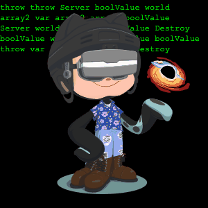

<h1 align="center"> Hi there :wave:, I'm Duc </h1>

## About me:

- :information_desk_person: I'm Đức - Duc - Duke - :sound: / dük /
- 🎓 I'm a Computer Science (Software Systems option) student at Concordia University.
- 👨🏻‍💻 I love participating in Hackathons, and do coding projects.

<strong>What I'm doing :point_down:</strong>

- Working on Eclipse Theia
- Learning Machine Learning/AI
- Just messing around in general :open_hands:

<strong>
My bucket list of things to learn/do 🌱:
</strong>

> in Software field of course, I have a life and a dog other than this 🤷🏻‍♂️

- [ ] Work on a project that has multithreading aspect
- [ ] Create a Chrome plugin
- [ ] Learn OpenCV
- [ ] Learn more about Rust
- [ ] Write a Vim/NeoVim plugin with Rust or Python
- [ ] Always wonder about Go, will give it a try!

 

